# Podcaster
> Keeps track of your favorite podcasts listening progress. Simply add the RSS feed into it and be able to get any details of the podcast and its available episodes, with the option of being able to download specific episodes or any random one.

I'm using Python 3.6.1 *f-string* formatting and `wget` to download the episodes. Not sure if it'll work on a Windows machine with cygwin or perhaps on a newer Windows 10 machine with the Ubuntu shell. If you use that setup, please let me know.

## Installation
Simple clone or download the repo and run the following command from within the extracted directory:

`python3 -m pip install .`

After installation the program can be ran as follows:

`podcaster [OPTIONS] COMMAND [ARGS]...`

If you don't want to install it, you can simply run it by calling the `main.py` script. I would recommend that you create a virtual environment for it as follows:

    cd Podcaster
    python3 -m venv venv
    source venv/bin/activate
    pip install -r requirements.txt
    python main.py

## How to use
My examples will assume that the program was not installed. If you did install it, simple replace `python main.py` with `podcaster`. If you run the script with no command line arguments, you'll get the help message.

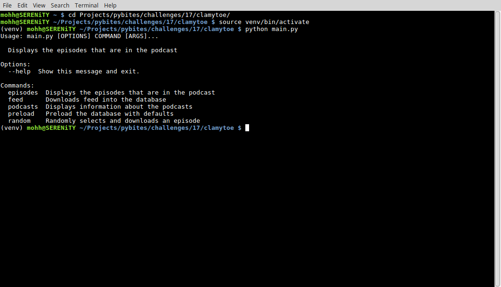

#### feed
The `feed` argument is used to add a new feed into the database.

`feed URL`

`feed https://pythonbytes.fm/episodes/rss`

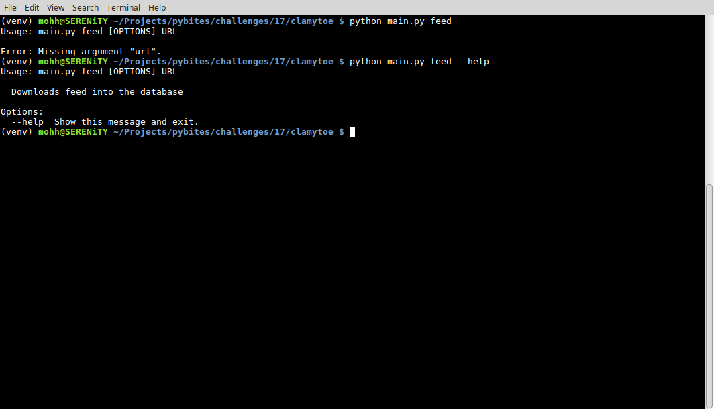

#### episodes
The `episodes` argument is used to list all of the episodes that are available for the selected podcast.

`episodes PODID EPISODEID DOWNLOAD`

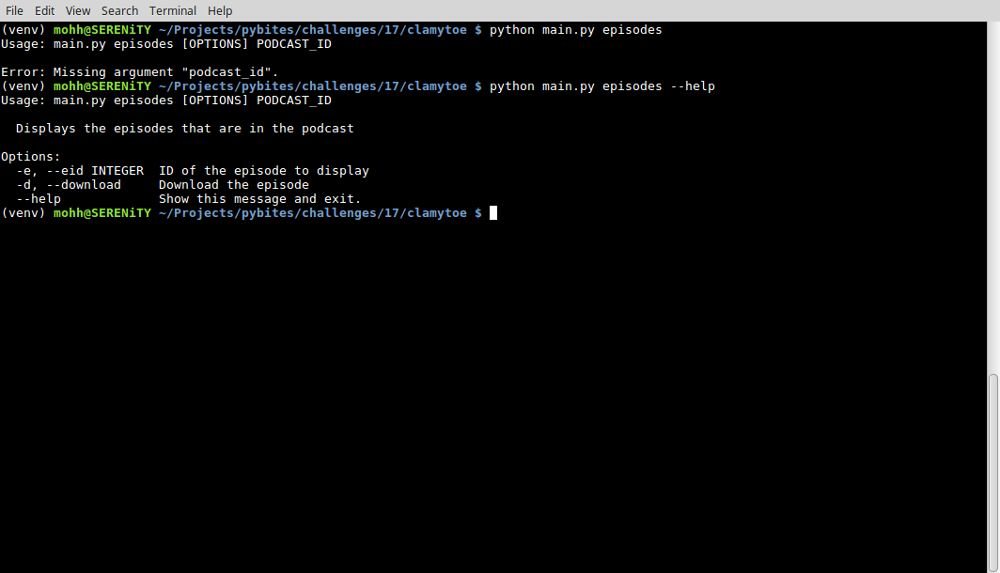

For example `episodes 1` will list all of the available podcasts. Not shown in the image, the space to the left of the podcast ID displays **Played** if the episode has already been downloaded.

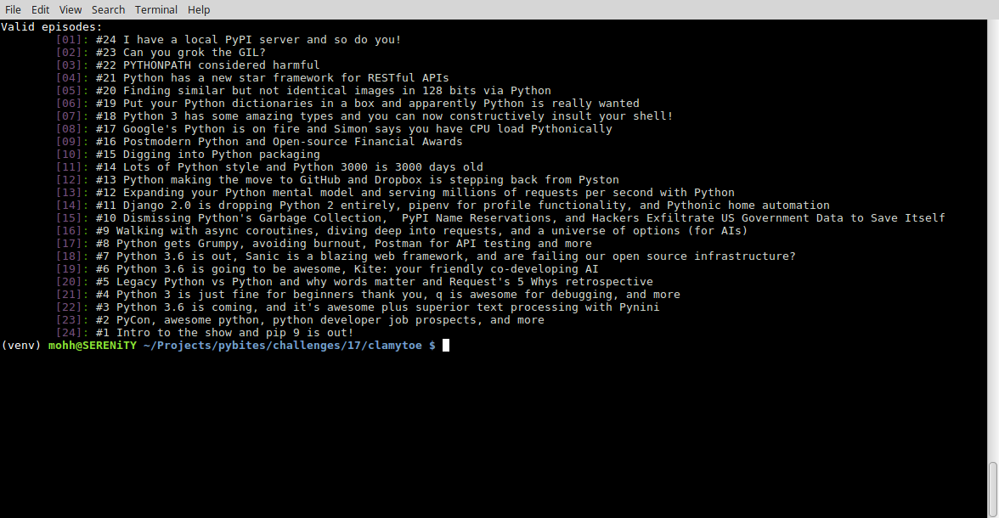

If you desire further details about an episode, you can additionally specify it by its Episode ID.

`episodes 1 --eid 10 `

`episodes 1 -e 10`

The extra information includes a more in depth summary of the episode, its duration, if it's been played, and at the end the **url** for the actual file.

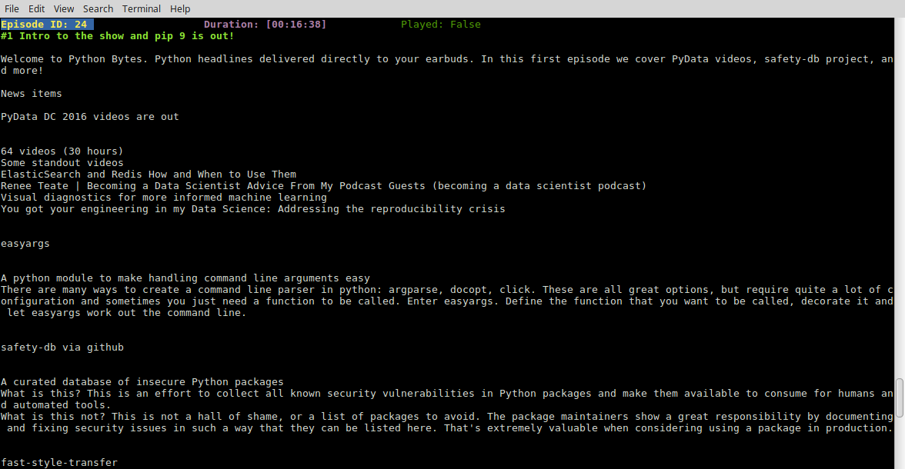

With the `episodes` argument you also have the option of downloading the episode by adding the `--download` or `-d` options:

`episodes 1 --eid 10 --download`

`episodes 1 -e 10 -d`

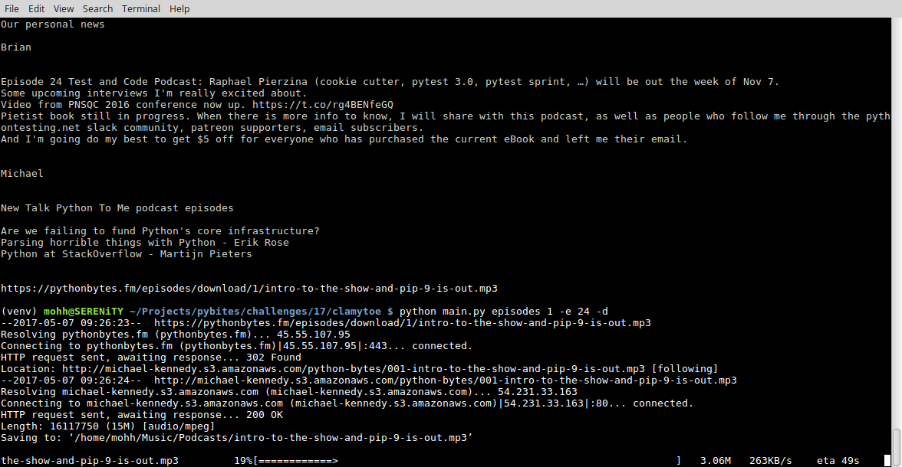

If your download is interrupted or you quit it for whatever reason, when you attempt to download the same episode again, it will pick up where it left off.

#### podcasts
The `podcasts` argument will list all of the podcasts that you have entered into the database. If none exists it will let you know.

The podcast ID, date last updated, how many episodes are available, the title, and subtitle of the podcast are displayed.

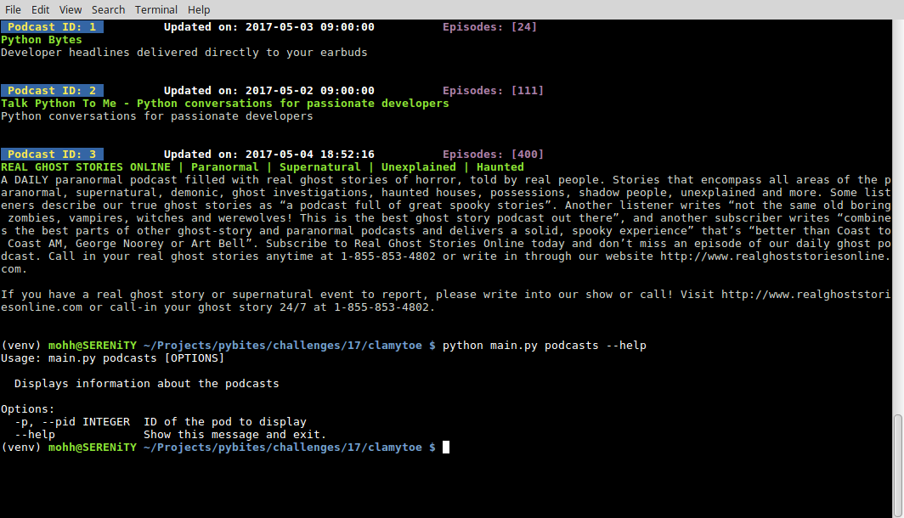

You can get further details about the podcast by specifying it's Podcast ID. This will include the author's name, their email address, a complete summary, and your progress status of how many episodes you've already downloaded.

`podcasts -p 1`

`podcasts --pid 1`

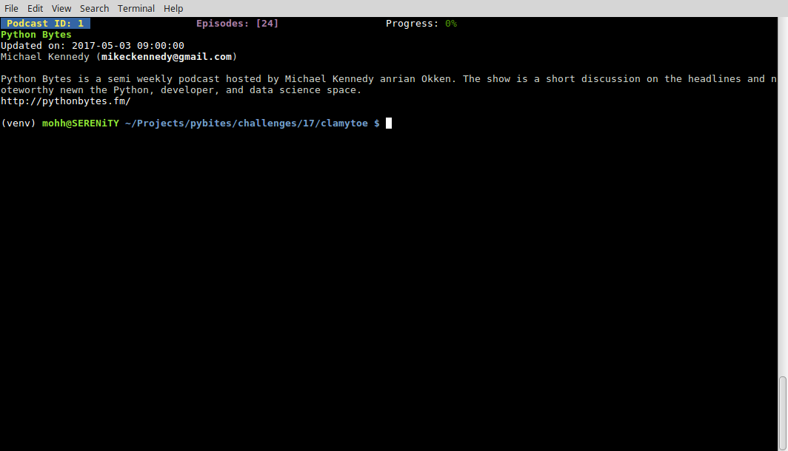

#### preload
I've provided some preloaded podcasts for ease of use. You have the option of adding just one of them at a time or selecting them all at once.

`preload --pod1`

`preload --pod2`

`preload --pod3`

`preload --all`

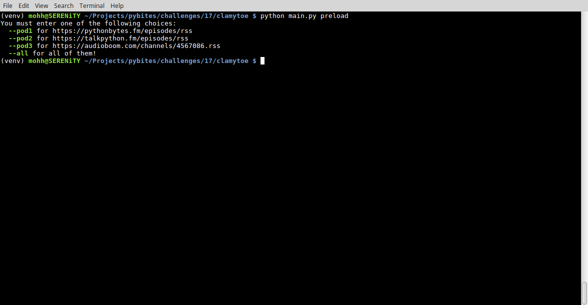

#### random
The use of the `random` argument will randomly select and unplayed episode from all of the available podcasts and download it for you. Once the download completes, that episode is marked off as having been played.

This option would be perfect for creating an entry into your cron and setting it to download a random episode automatically for you. Check out this [CronHowTo](https://help.ubuntu.com/community/CronHowto) if you need a cron refresher.

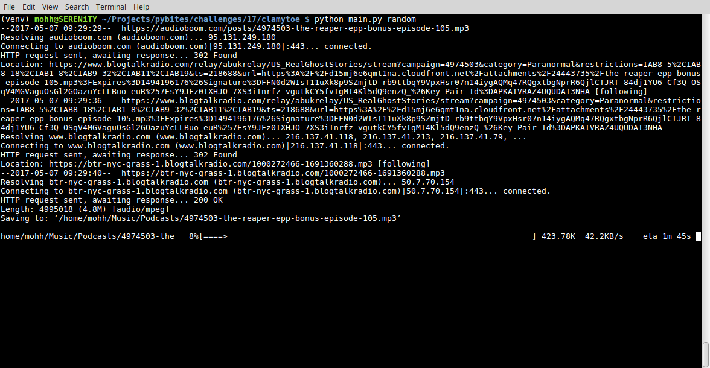

### Podcasts Episodes
The episodes are saved to your account's Music folder under the Podcasts directory.

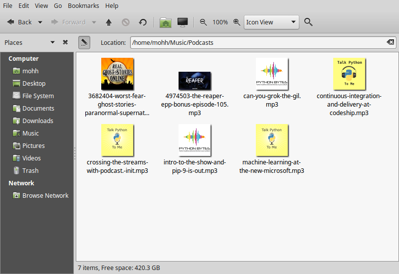
